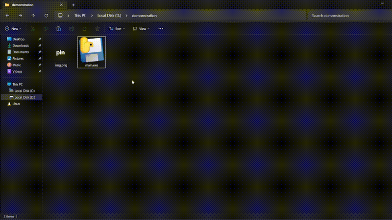

# Pin — Click-Through Overlay Window


A lightweight Windows overlay application written in Python and WinAPI that allows users to pin images on top of all windows without interfering with normal workflow.

## Features

* Always-on-top image overlay
* Fully click-through mode
* Adjustable transparency
* Drag and resize support
* Aspect-ratio-preserving scaling (`Shift`)
* Runtime setup mode toggle (`Ctrl + Alt + S`)
* Multiple overlay instances supported
* Lightweight CPU usage
* Native WinAPI implementation
* No heavyweight UI frameworks

## Use Cases

This project is useful for workflows where reference material should stay visible without interrupting interaction with other applications.

Examples:

* Developers keeping UI references visible
* Artists using drawing references
* Designers comparing layouts
* Productivity setups with persistent notes/images
* Stream overlays or utility overlays

## Preview



---

# Tech Stack

* Python
* WinAPI
* GDI
* `UpdateLayeredWindow`
* `ctypes`
* Pillow (`PIL`)
* NumPy

## How It Works

The application creates a layered transparent window using native WinAPI calls and renders images directly through GDI.

When setup mode is disabled, the overlay becomes fully click-through, allowing all mouse interaction to pass directly to underlying applications.

Because rendering only occurs when updates are needed, CPU usage remains extremely low during idle operation.

---

# Installation

## Requirements

* Windows
* Python 3.x

## Install Dependencies

```bash
pip install pillow numpy
````

## Run From Source

```bash
python main.py
```

## Optional Executable Build

Using PyInstaller:

```bash
pyinstaller --onefile --noconsole main.py
```

---

# Controls

| Keybind          | Action                               |
| ---------------- | ------------------------------------ |
| `Ctrl + Alt + S` | Toggle setup mode                    |
| `Shift`          | Preserve aspect ratio while resizing |

---

# Current Limitations

* Windows only
* Image overlays only
* Keybinds are not configurable yet
* Hardware acceleration is not implemented

---

# Future Improvements

Planned ideas for future versions:

* Video overlays
* Text / sticky note overlays
* Browser-based overlays
* 3D scene rendering
* Improved UI controls
* Configurable keybinds
* Better overlay management

---

# Why This Project

Most desktop overlay tools are either heavyweight, intrusive, or focused on streaming use cases.

This project focuses on simplicity, responsiveness, and minimal interference with the user's workflow.